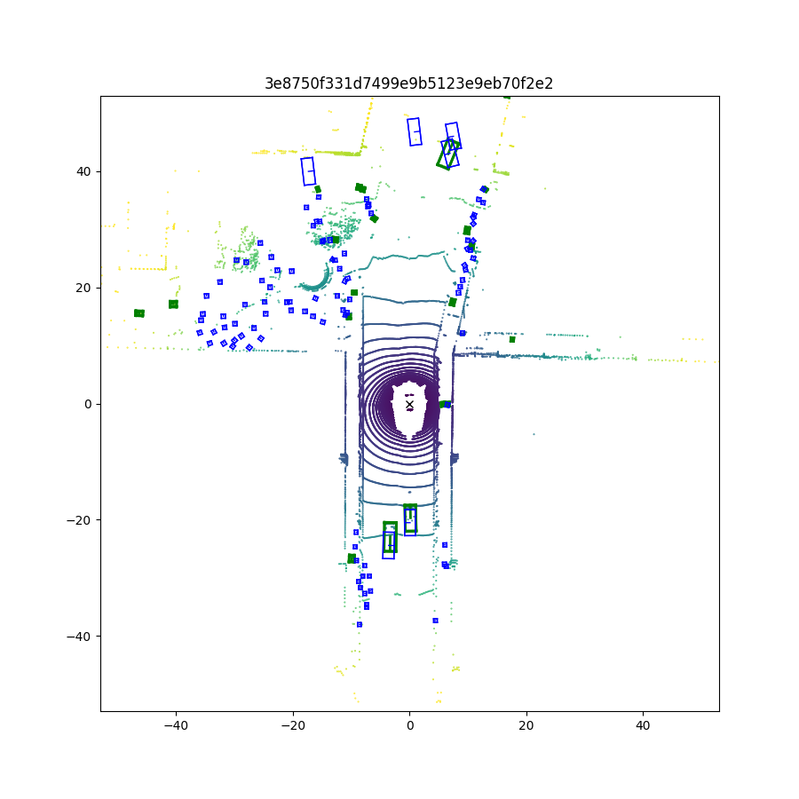

# mmdet3d_demo
基于mmdetection3d-1.0.0rc6，一个实例性的工程，用于展示mmdetection3d的使用方法。

## 1. Install


```sh
# Create a new conda environment and install torch
conda create -n bev python=3.8 -y
conda activate mmdet3d
pip install torch==1.10.0+cu113 torchvision==0.11.0+cu113 torchaudio==0.10.0 -f https://download.pytorch.org/whl/torch_stable.html

# Install gcc-6
conda install -c omgarcia gcc-6 # gcc-6.2

# It will be a long time when install mmcv-full
pip install --no-cache-dir mmcv-full==1.4.0 mmdet==2.14.0 mmsegmentation==0.14.1 

# Install mmdetection3d
git clone https://github.com/open-mmlab/mmdetection3d.git
cd mmdetection3d
git checkout v0.17.1
pip install -v -e . 

# Install other requirements
pip install open3d
```
PS: 确保安装的torch与cuda版本与mmcv与mmdet版本对应，否则会出现错误。

## 2. Start
文件组织如下：
```
mmdet3d_demo
├── configs
│   ├── _base_
│   ├── bevformer
│   ├── second
│   └── ...
├── data
│   ├── bevformer
│   ├── demo
│   └── ...
├── mmdet3d_plugin
│   ├── bevformer
│   ├── ...
│   └── __init__.py
├── tools
│   ├── bevformer
│   └── ...
├── weights
│   ├── bevformer_tiny_epoch_24.pth
│   ├── hv_second_secfpn_6x8_80e_kitti-3d-car_20200620_230238-393f000c.pth
│   └── ...
├── pcd_demo.py
...
```
### pcd_demo

从releases中下载权重, 然后放在`./weights/` 文件夹下。

```sh
python pcd_demo.py data/demo/kitti/kitti_000008.bin configs/second/hv_second_secfpn_6x8_80e_kitti-3d-car.py weights/hv_second_secfpn_6x8_80e_kitti-3d-car_20200620_230238-393f000c.pth --show
```

PS: 也可以设置好参数后使用pycharm直接运行`pcd_demo.py`文件。


### bevformer_demo

**准备数据集**

下载nuScenes V1.0 的full或者mini数据集（包括data和CAN bus expansion data），然后处理数据：

```shell
python tools/bevformer/create_data.py nuscenes --root-path ./data/bevformer/nuscenes --out-dir ./data/bevformer/nuscenes --extra-tag nuscenes --version v1.0 --canbus ./data/bevformer
```

**测试**

从releases中下载权重, 然后放在`./weights/` 文件夹下。
```shell
python tools/bevformer/test.py configs/bevformer/bevformer_tiny.py weights/bevformer_tiny_epoch_24.pth --eval bbox
```
PS: 也可以设置好参数后使用pycharm直接运行`test.py`文件。

**训练**

```shell
python tools/bevformer/train.py configs/bevformer/bevformer_tiny.py
```
PS: 也可以设置好参数后使用pycharm直接运行`train.py`文件。

**可视化**

见`tools/bevformer/visual.py`



