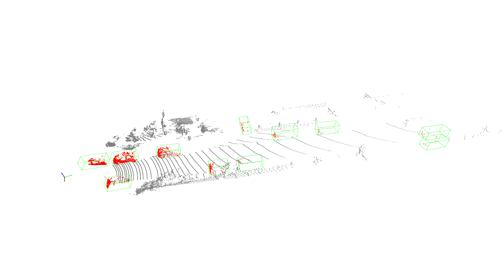

# mmdet3d_demo
mmdet3d-v0.17.1 demo，for learning and example

## 1. Install


```sh
# Create a new conda environment and install torch
conda create -n bev python=3.8 -y
conda activate mmdet3d
pip install torch==1.10.0+cu113 torchvision==0.11.0+cu113 torchaudio==0.10.0 -f https://download.pytorch.org/whl/torch_stable.html

# Install gcc-6
conda install -c omgarcia gcc-6 # gcc-6.2

# It will be a long time when install mmcv-full
pip install --no-cache-dir mmcv-full==1.4.0 mmdet==2.14.0 mmsegmentation==0.14.1 

# Install mmdetection3d
git clone https://github.com/open-mmlab/mmdetection3d.git
cd mmdetection3d
git checkout v0.17.1
pip install -v -e . 

# Install other requirements
pip install open3d
```
PS: Ensure that the version of torch and cuda is consistent with the version of mmcv-full and mmdet.

## 2. Run

Download the weights from releases, and put it in the ./weights/ folder.

```sh
python pcd_demo.py data/kitti/kitti_000008.bin configs/second/hv_second_secfpn_6x8_80e_kitti-3d-car.py weights/hv_second_secfpn_6x8_80e_kitti-3d-car_20200620_230238-393f000c.pth --show
```

PS: Or you can use custom_config.py to instead of the default config file.
